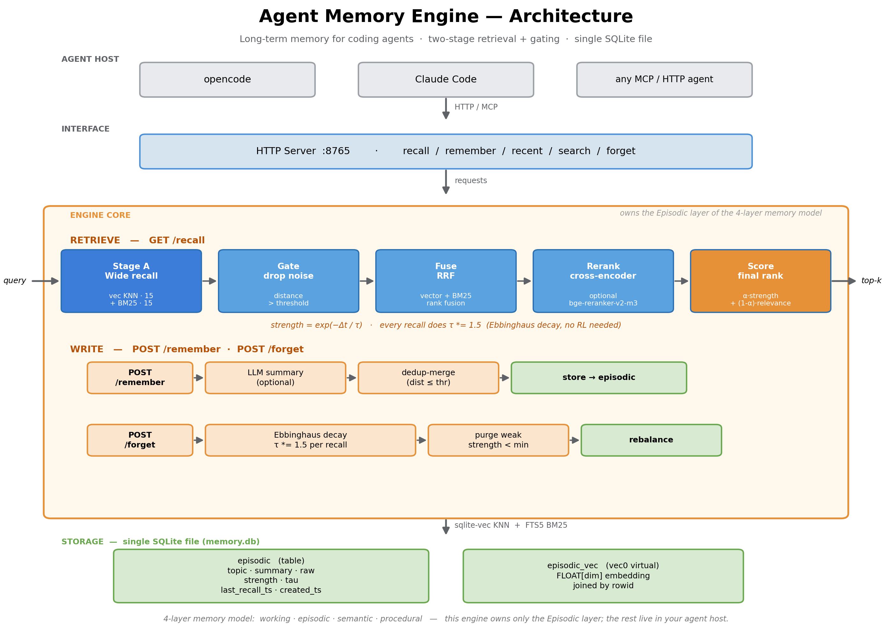
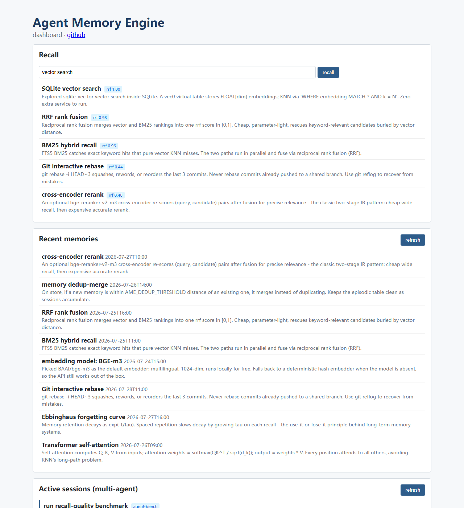

# Agent Memory Engine

[](https://github.com/ljftwq-dev/agent-memory-engine/actions/workflows/ci.yml)
[](https://pypi.org/project/agent-memory-engine-ljf/)
[](https://opensource.org/licenses/MIT)
[](https://www.python.org/downloads/)

**中文文档：[README-zh.md](README-zh.md)**



_Architecture overview — see [docs/architecture.md](docs/architecture.md) for the full breakdown._



_Web dashboard — recall a query, browse recent memories, and watch live multi-agent sessions._

A **long-term memory engine** for coding agents (opencode / claude-code / any
HTTP-speaking agent). Lets an agent "remember" past sessions across restarts:
each new turn auto-recalls related history, each finished turn auto-stores a new
memory.

> **Why?** Coding agents forget — every new session starts blind, with past
> decisions, fixes, and conventions gone. This engine gives them cheap,
> persistent memory: each turn auto-recalls related history, each finished turn
> auto-stores a new memory.
>
> Inspired by SJTU's [MemRL paper](https://arxiv.org/abs/2601.03192), with an
> engineering tradeoff: borrow its **two-stage retrieval + gating**, drop the
> full RL (dialogue has no clean reward signal - see [design.md](docs/design.md)).

---

## Why it (differs from Mem0 / Chroma)

Most memory layers do **pure semantic recall** - nearest neighbors go straight
into the prompt. This engine is different:

| Feature | What it buys you |
|---|---|
| **Two-stage retrieval + gating** | Wide KNN recall (15) → drop pure noise → rerank by `score = α·strength + (1-α)·sim` → top-k. **No more "semantically-adjacent-but-useless" junk in your prompt.** |
| **Hybrid recall (vector + BM25)** | Vector KNN for semantic match + FTS5 BM25 for keyword match, fused via RRF. Catches keyword hits the vector path alone would miss. Disable with `AME_HYBRID_ENABLE=0`. |
| **Cross-encoder rerank (optional)** | After hybrid fusion, a cross-encoder (bge-reranker-v2-m3) re-scores `(query, candidate)` pairs for precise relevance — the classic two-stage IR pattern (cheap wide recall → expensive precise rerank). Off by default; gracefully skipped if the model isn't loaded. Enable with `AME_RERANKER_ENABLE=1`. |
| **Multi-agent collaboration** | Sessions register their current task; siblings see "who's doing what" via `GET /sessions/active`. A fast-finishing agent can pick up a sibling's in-progress work without you writing a handoff doc. |
| **LLM summarization** | Optionally condenses each turn into a semantic sentence *before* embedding (better retrieval than raw dialogue). Falls back to raw text if no LLM is configured. |
| **Ebbinghaus decay** | Frequently-recalled memories decay slower (`τ *= 1.5` per recall). Long-unused ones naturally fade. Use-it-or-lose-it, no RL training needed. |
| **Single SQLite file** | Structured data + vector index in one `.db`. No separate vector server, no extra process - just copy the file. |
| **Agent & LLM agnostic** | Plain HTTP. Default embedder is BGE-m3 (local, free); LLM summary uses any OpenAI-compatible endpoint (GLM / OpenAI / Ollama). |

---

## Benchmark

A retrieval-quality ablation on 40 coding-agent memories + 24 hand-labeled
queries (graded relevance). Decay is neutralized so the numbers reflect pure
retrieval/reranking quality. Full method: [`benchmark/README.md`](benchmark/README.md).

| Condition | nDCG@5 | Recall@5 |
|---|---|---|
| pure-vector | 0.842 | 0.875 |
| hybrid (vector + BM25, RRF) | 0.868 | 0.896 |
| **hybrid + cross-encoder rerank** | **0.927** | **0.979** |

Each stage earns its keep:

| step | nDCG@5 gain | Recall@5 gain |
|---|---|---|
| +hybrid (RRF fusion) | +0.026 | +0.021 |
| +reranker (cross-encoder) | +0.059 | +0.083 |

The cross-encoder is the biggest single win — reading `(query, candidate)`
jointly beats encoding them separately, exactly as IR theory predicts.

_Reproduced 2026-07-28 (BGE-m3 + bge-reranker-v2-m3). Run it yourself:
`python benchmark/run_benchmark.py`._

---

## Quick start

> **Live demo (no install):** https://ljftwq-dev.github.io/agent-memory-engine/demo/
> Runs `all-MiniLM-L6-v2` in your browser — real semantic recall over demo data.

**From PyPI:**
```bash
pip install agent-memory-engine-ljf
```

**From source:**
```bash
git clone https://github.com/ljftwq-dev/agent-memory-engine
cd agent-memory-engine
pip install -e ".[all]"        # core + real embeddings + dev deps
cp .env.example .env           # adjust if needed (defaults work out of the box)

python -m engine.server        # start HTTP server (default :8765)
```

The engine works in two modes:

- **No embedding model installed** → automatic hash-fallback (deterministic,
  reproducible, *no real semantics*). Great for trying the API, bad for recall
  quality. To get real semantics install the `[embed]` extra (BGE-m3).
- **BGE-m3 installed** → full multilingual semantic embeddings.

Any agent talks to it over HTTP:

```
GET  /health                 service status
GET  /recall?q=&k=3          two-stage semantic recall (the core)
GET  /recent?k=5             latest k memories (by time)
GET  /search?q=              keyword LIKE match
POST /remember               store a memory {topic, summary, raw?, ...}
POST /forget                 run an Ebbinghaus decay pass {purge?, threshold?}
```

Want LLM summarization? Set `AME_LLM_BASE_URL` + `AME_LLM_API_KEY` in `.env`
(any OpenAI-compatible endpoint). Leave them empty and it's a pure retrieval
engine - still fully usable.

Seed some demo data and try it:

```bash
python examples/seed_demo.py
python -m engine.recall "vector search" -k 3
```

---

## Repository layout

```
agent-memory-engine/
├── engine/            core engine
│   ├── config.py      .env / env-var loader (no hardcoded paths)
│   ├── db.py          SQLite + sqlite-vec schema
│   ├── embed.py       BGE-m3 embedder + hash fallback
│   ├── recall.py      two-stage retrieval + gating (core)
│   ├── reranker.py    optional cross-encoder precision rerank
│   ├── remember.py    store + optional LLM summary + dedup-merge
│   ├── forget.py      Ebbinghaus decay loop (nightly cron)
│   └── server.py      stdlib HTTP server
├── examples/
│   ├── seed_demo.py              load generic demo data
│   ├── opencode/memory.ts        reference opencode plugin (inject + recall + store)
│   └── claude-code/              .mcp.json + CLAUDE.md snippet (model-driven)
├── tests/
│   ├── conftest.py               temp DB + forced hash fallback (CI-friendly)
│   ├── test_recall.py            gating / dedup / decay / reinforcement tests
│   └── test_reranker.py          rerank fallback / mock-promote tests
└── docs/
    ├── architecture.md           four-layer memory model + module map
    └── design.md                 why two-stage, why no full RL
```

---

## How the design works (in one paragraph)

**Problem**: pure semantic match causes *context pollution* - "semantically
close" ≠ "useful", so you shovel adjacent junk into the prompt.
**Solution (wide in, strict out)**:
1. **Gate only kills pure noise** (distance > threshold). In hybrid mode, BM25 hits bypass the gate.
2. **Fuse + rerank decides relevance**: in hybrid mode relevance = RRF-fused vector + BM25 rank; otherwise `sim = 1 - distance`. If the cross-encoder reranker is on, it replaces that relevance with a precise `(query, candidate)` score. Final `score = α·strength + (1-α)·relevance`, take top-k.
3. **`strength` is lightweight utility**: Ebbinghaus `exp(-Δt/τ)`, where each
   recall does `τ *= 1.5`. Frequently-recalled memories stay strong. This
   replaces MemRL's Q-value without needing reward data.
4. **No full RL**: dialogue has no clean reward signal; a fabricated proxy adds
   more noise than the Q-value is worth.

Full writeup: [`docs/design.md`](docs/design.md).

---

## Configuration (`.env`)

| Key | Default | Meaning |
|---|---|---|
| `AME_DB_PATH` | `~/.agent-memory/memory.db` | database path |
| `AME_EMBED_MODEL` | `BAAI/bge-m3` | embedding model (local & free) |
| `AME_EMBED_DIM` | `1024` | vector dim (must match the model) |
| `AME_LLM_BASE_URL` | (empty = off) | OpenAI-compatible API base |
| `AME_LLM_API_KEY` | (empty) | LLM key |
| `AME_LLM_MODEL` | `glm-4-flash` | model name for summarization |
| `AME_RECALL_THRESHOLD` | `0.9` | distance gate (larger = looser) |
| `AME_RECALL_POOL` | `15` | stage-A wide recall count |
| `AME_ALPHA` | `0.5` | strength weight in rerank (0..1) |
| `AME_MIN_STRENGTH` | `0.05` | drop memories below this real-time strength |
| `AME_DEDUP_THRESHOLD` | `0.45` | on store, distance ≤ this merges into existing |
| `AME_HYBRID_ENABLE` | `1` | vector + BM25 hybrid recall (0 = vector only) |
| `AME_BM25_POOL` | `15` | stage-A BM25 recall count (hybrid mode) |
| `AME_RERANKER_ENABLE` | `0` | cross-encoder precision rerank after fusion (opt-in) |
| `AME_RERANKER_MODEL` | `BAAI/bge-reranker-v2-m3` | cross-encoder model (multilingual) |
| `AME_RERANKER_POOL` | `0` | how many gated candidates to rerank (0 = all) |
| `AME_BACKUP_ENABLE` | `1` | periodic safe snapshots of the memory DB |
| `AME_BACKUP_INTERVAL_HOURS` | `6` | how often to snapshot |
| `AME_BACKUP_KEEP` | `5` | keep only the newest N backups |
| `AME_SESSION_TIMEOUT_HOURS` | `2` | session goes stale after this long w/o heartbeat |

---

## Tests

```bash
pip install -e ".[dev]"
pytest -q
```

Tests run on the hash-fallback embedder (no model download) so they're fast and
CI-friendly. They cover: create, exact-match recall, gating, dedup-merge,
Ebbinghaus decay, recall-time reinforcement, vector-dim consistency, hybrid
RRF rescue/normalization, and the reranker fallback + mock-promote behavior.

---

## License

MIT
